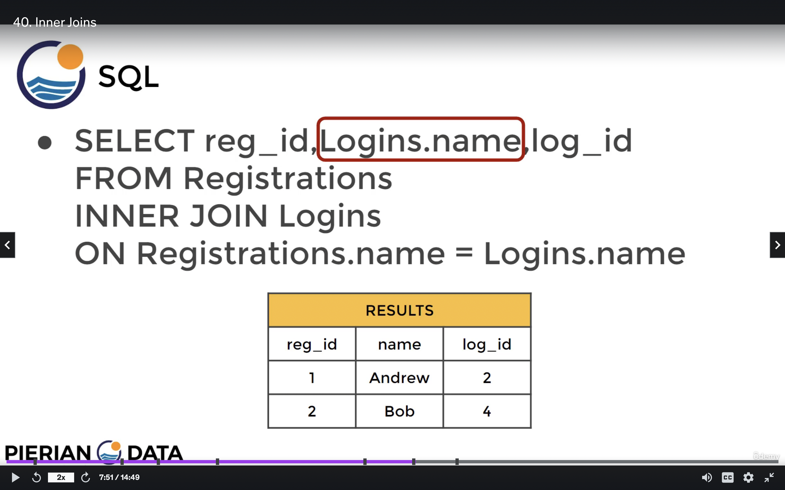
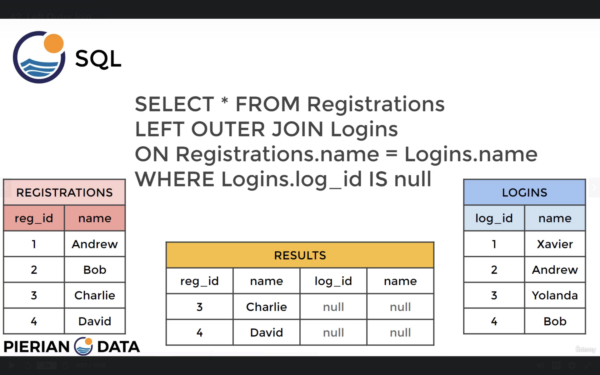

# **JOINS**

Overview of JOINS
Welcome to the JOINS Section!

In this section we will discuss how to combine tables in our database with the use of JOIN statements! Sometime JOINS can be tricky for beginners, I mention throughout the next lectures Venn Diagrams for JOINs, so if you want more resources after reviewing the lectures, check out the following helpful links:

> [SQL JOINS Explained with Venn Diagrams]( https://blog.codinghorror.com/a-visual-explanation-of-sql-joins/ )

> [SQL JOIN Examples](https://www.talend.com/)

> [Wikipedia Page on SQL JOINS](https://en.wikipedia.org/wiki/Join_(SQL))

## Section Overview
- Creating an alias with the AS clause
- Understanding different kinds of JOINs
    1. INNER JOINS
    2. OUTER JOINS 
    3. FULL JOINS
    4. UNIONS


## **AS CLAUSE**
> AS jus gives a name to acolumn or value . this gets executed at end hence we cant use it in WHERE statement GROUP BY etc

> The AS operator gets executed at the very end of a query, meaning that we can not use the ALIAS inside a WHERE operator.

---
- see the outputs of both the queries ... better readability in second

```sql
SELECT COUNT (amount) 
FROM payment
```

    "count"
    14596

```sql
SELECT COUNT (amount) AS num_transactions
FROM payment
```
    "num_transactions"
    14596


gives the number of transactions with num_transactions as heading
```sql
SELECT COUNT(*) AS num_transactions
FROM payment
```

customer id with sum of amount spent with heading as total_spent
```sql
SELECT customer_id, SUM (amount) AS total_spent
FROM payment
GROUP BY customer_id
```


**DO THIS** 
```sql
SELECT customer_id, SUM (amount) AS total_spent
FROM payment
GROUP BY customer_id
HAVING SUM (amount) > 100
```
**NOT THIS**
```sql
SELECT customer_id, SUM (amount) AS total_spent
FROM payment
GROUP BY customer_id
HAVING total_spent > 100
```

> **dont use alias as frikkin variable ffs it gets applied at end**
---

## **INNER JOINS**

syntax
```sql
SELECT * FROM TableA 
INNER JOIN TableB
ON TableA.col_match = TableB.col_match
```

which is essentially same as 
```sql
SELECT * FROM TableB 
INNER JOIN TableA
ON TableA.col_match = TableB.col_match
```

makes a table without any duplicate name columns from 2 tables
```sql
SELECT reg_id,Logins.name.log_id 
FROM Registrations
INNER JOIN Logins
ON Registrations.name = Logins.name
```




---
**Remember that table order won't matter in an INNER JOIN**

**Also if you see just JOIN without the INNER, PostgreSQL will treat it as an INNER JOIN.**

---

eg:
combined CUSTOMER and PAYMENT tables
```sql
SELECT * 
FROM customer
INNER JOIN payment
ON customer.customer_id = payment.customer_id 
-- results are only common entries of customer id in both the tabkes
```

- use something unique(in the table like some id or fullname and not payment ammount or pincode etc) to join tables ud=sing ON ofc
- if u are printing (selecting *) its ok
  - but if selecting particular columns
    - put column name directly of that column is only found in one table
    - put tableName.columnName if the coloumn is found on both tables. (the column u used to join in most cases)

---

> yet another example:
```sql
SELECT payment_id, payment.customer_id, first_name
FROM payment
INNER JOIN customer
ON payment.customer_id = customer.customer_id
```


## **OUTER JOINS**

    They will allow us to specify how to deal with values only present in one of the tables being joined.
    we will explain: 
        FULL OUTER JOIN
            Clarifying WHERE null 
        LEFT OUTER JOIN
            Clarifying WHERE null 
        RIGHT OUTER JOIN
            Clarifying WHERE null

## **FULL OUTER JOIN**


> **SYNTAX**
```sql
    SELECT * FROM TableA
    FULL OUTER JOIN TableB
    ON TableA.col_match = TableB.col_match
```
is same as

```sql
SELECT * FROM TableB
FULL OUTER JOIN TableA
ON TableA.col_match = TableB.col_match
```


> you will get the following result
 


---
## **FULL OUTER JOIN WITH "WHERE"**


```sql
SELECT * FROM TableA
FULL OUTER JOIN TableB
ON TableA.col_match = TableB.col_match 
WHERE TableA.id IS null OR 
TableB.id IS null
```

same as
```sql
SELECT * FROM TableB 
FULL OUTER JOIN TableA
ON TableA.col_match = TableB.col_match 
WHERE TableA.id IS null OR
TableB.id IS null
```

> **EXACT OPPOSITE OF INTER JOIN**


    to find any payemt_ids or customer_ids which are not interlinked 
    i.e there shouldnt be a payment which does not connect to any customer
    nor any customer info who hasnt done any payment
    basically all entries in both table should coonnect customer_id wise

```sql
SELECT FROM customer 
FULL OUTER JOIN payment
ON customer.customer_id = payment.customer_id 
WHERE ICustomer.customer_id IS null
OR payment.payment_id IS null
```

    ideally u shouldnt get anything after runnning this query which implies u following all privacy policies 
    not storing any random customers info who havent made any payment 
    nor any payments which cant be linked to any customer_ids

```sql
SELECT COUNT (DISTINCT customer_id) FROM customer
```

```sql
SELECT COUNT (DISTINCT customer_id) FROM payment
```

    ull get same 599 unique customer ids in both cases also proves our above poinrt more
    although this alone is not enuf as there could be diff cus ids in both .. count will be same but few could be diff


---
## **LEFT OUTER JOIN /**
## **LEFT JOIN**

    A LEFT OUTER JOIN results in the set of records that are in the left table, if there is no match with the right table, the results are null.
    Later on we will learn how to add WHERE statements to further modify a LEFT OUTER JOIN

    has left table data and if anyting in right coressponding 
    
    to entry in left then its connected 
    if not those entrys will be left NULL

    has everything from left table
    adds columns from right table
    if left table row(entry / unique id ) has entry or row in right table then its added and ull get long row
    if not there half row of data and rem half of NULLs


```sql
SELECT * FROM TableA 
LEFT JOIN TableB
ON TableA.col_match = TableB.col_match
```
    defintaly not same as


---
---

## **LEFT OUTER JOIN WITH WHERE**

    GET ROWS UNIQUE TO LEFT TABLE


---

SYNTAX:
```sql
SELECT * FROM TableA 
LEFT OUTER JOIN TableB
ON TableA.col_match = TableB.col_match 
WHERE TableB.id IS null
```




---
```sql
SELECT film.film_id, title, inventory_id, store_id
FROM film
LEFT JOIN inventory 
ON inventory.film_id = film.film_id
```


---

```sql
SELECT film.film_id, title, inventory_id, store_id 
FROM film
LEFT JOIN inventory 
ON inventory.film_id = film.film_id 
WHERE inventory.film_id IS NULL
```


---

## **RIGHT JOIN/**
## **RIGHT OUTER JOIS**


• A RIGHT JOIN is essentially the same as a LEFT JOIN, except the tables are switched. 

• This would be the same as switching the table order in a LEFT OUTER JOIN.

• Let's quickly see some examples of a RIGHT JOIN.


> right outer join or right join both is same as left join when tables are interchanges

## **right outer join with WHERE**


    It is up to you and how you have the tables organized "in your mind" when it comes to choosing a LEFT vs RIGHT join, since depending on the table order you specify in the JOIN, you can perform duplicate JOINS with either method


## **UNION**
---
    The UNION operator is used to combine the result-set of two or more SELECT statements.
    
    It basically serves to directly concatenate two results together, essentially "pasting" them together.


to

or


> problem: 1

> California sales tax laws have changed and we need to alert our customers to this through email.
What are the emails of the customers who live in California?

```sql
    SELECT district,email FROM address
    INNER JOIN customer
    ON address.address_id = customer.address_id
    WHERE district = 'California'
```

> problem 2

> A customer walks in and is a huge fan of the actor "Nick Wahlberg" and wants to know which movies he is in.
Get a list of all the movies "Nick Wahlberg" has been in.

```sql
    SELECT title FROM film
    INNER JOIN film_actor 
    ON film.film_id = film_actor.film_id
    INNER JOIN actor 
    ON actor.actor_id = film_actor.actor_id
    WHERE first_name ILIKE 'NICK' AND last_name ILIKE 'Wahlberg'
```
> frikkin boosted my confidence , guessed to use double inner join even not knowing this exists or works


