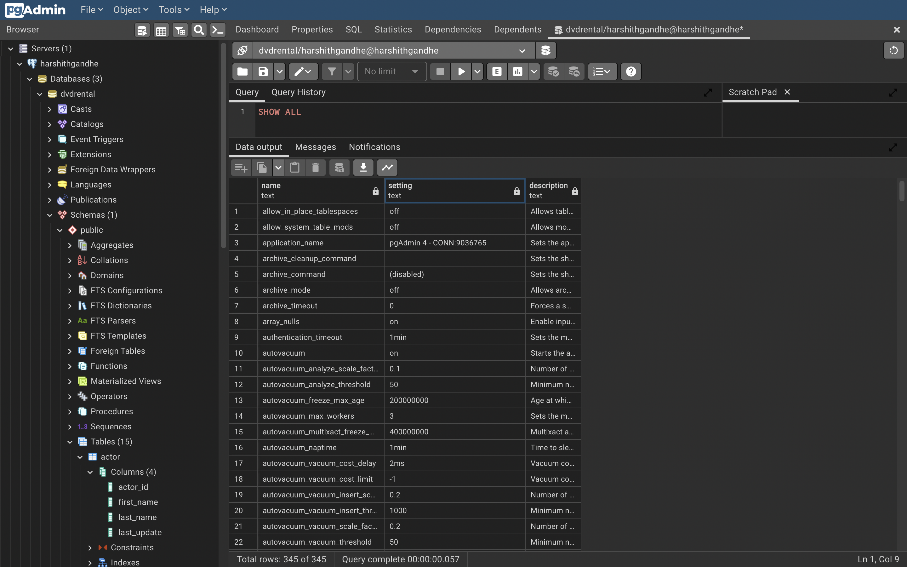
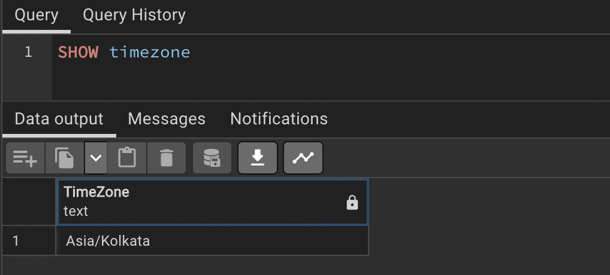
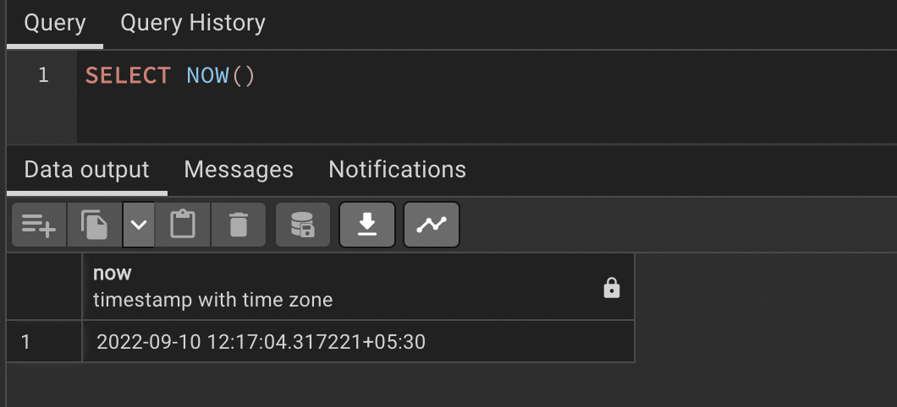
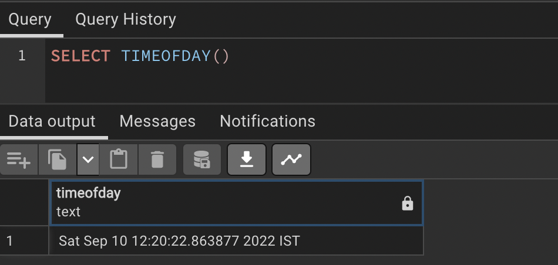
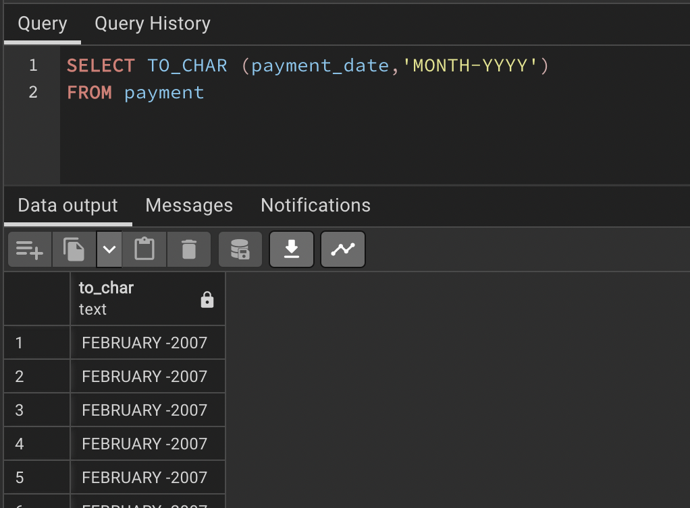
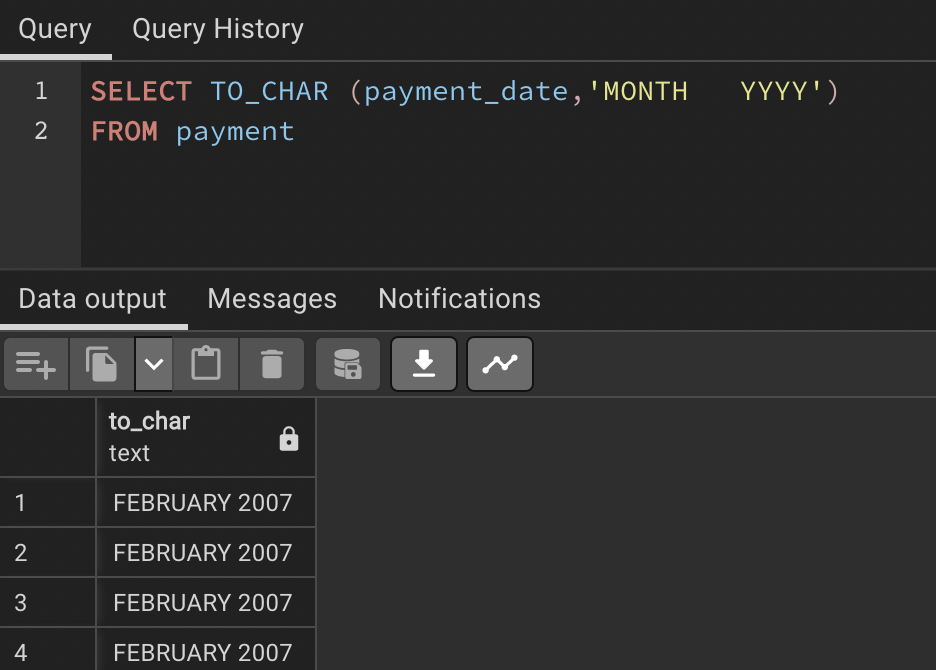
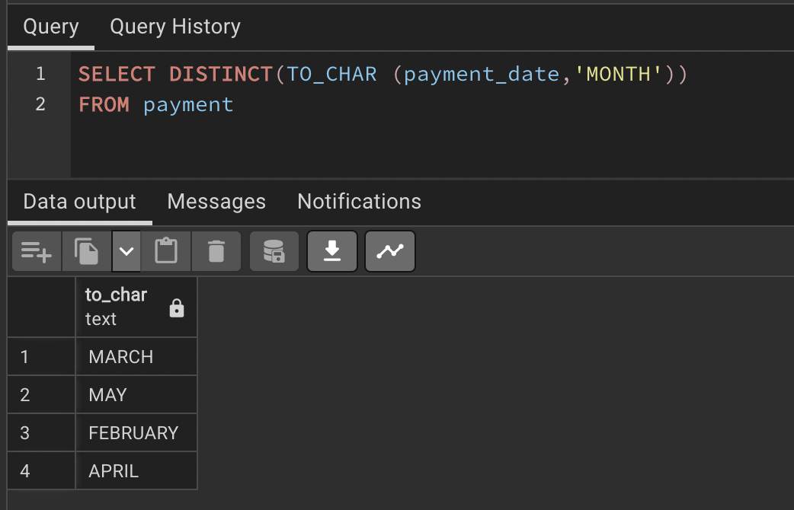
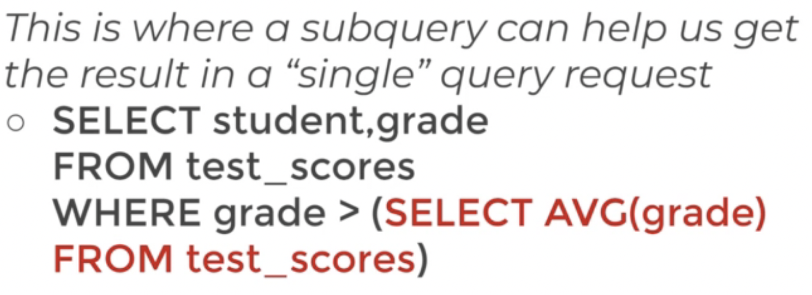
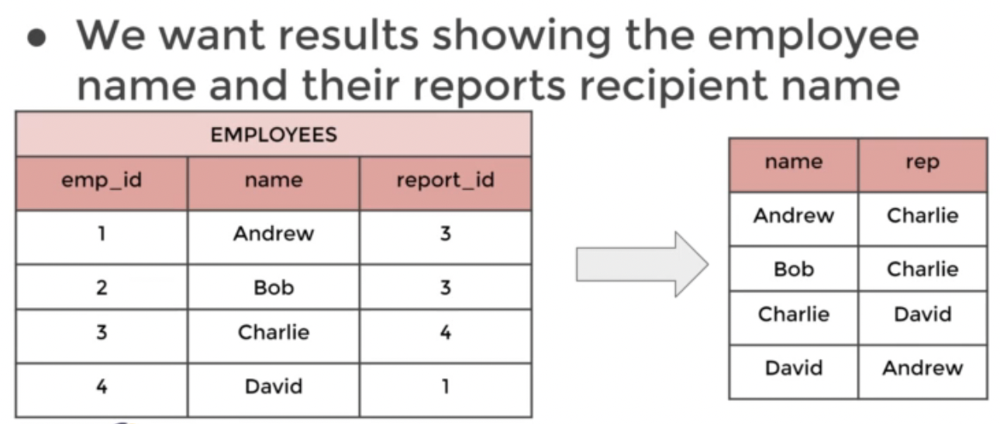

### Section Overview
---
    Timestamps and EXTRACT 
    Math Functions
    String Functions 
    Sub-query 
    Self-Join

    We've already seen that PostgreSQL can hold date and time information: 
    - TIME - Contains only time 
    - DATE - Contains only date
    - TIMESTAMP - Contains date and time 
    - TIMESTAMPTZ - Contains date,time, and timezone

    Careful considerations should be made when designing a table and database and choosing a time data type.
    Depending on the situation you may or may not need the full level of TIMESTAMPTZ
    Remember, you can always remove Settin historical information, but you can't add it!


---
```sql
SHOW ALL
```


---
```sql
SHOW timezone
```


---
```sql
SELECT NOW()
```
this ull get timestamp form


---
```sql
SELECT TIMEOFDAY()
```
this is string form


```sql
SELECT CURRENT_DATE
--for date
SELECT CURRENT_TIME
--for time
```

### **EXTRACT()**
Allows you to "extract" or obtain a sub-component of a date value 
```sql
EXTRACT(YEAR FROM date_col)
```


### **AGE()**
Calculates and returns the current age given a timestamp
Useage:

```sql
AGE(date_col)
```
    Returns
    13 years 1 mon 5 days 01:34:13.0034


### **TO_CHAR()**
General function to convert data types to text
    
```sql
-- Useful for timestamp formatting 
-- Usage:
TO_CHAR(date_col, 'mm-dd-yyyy')
```
---
> to extract year from payment date 
```sql
SELECT EXTRACT (YEAR FROM payment_date) AS myyear
FROM payment
```

> check this out
> 
> and see postgres documentation on TO_CHAR for more "DATA FORMATTING FUNCTIONS"
```sql
SELECT TO_CHAR (payment_date, 'MONTH-YYYY')
FROM payment
```


```sql
SELECT TO_CHAR (payment_date     'MONTH-YYYY')
FROM payment
```



    use MM/dd/YYYY or mon/YYYY etc for different formats of times and dates


### **Quick Note on TO_CHAR**
This is a note in regards to the next lecture, we've gotten a lot of questions of why TO_CHAR "doesn't work" for one of the assessment questions. It actually does work, but you need to realize certain codes are "blank padded to 9 characters", which means instead of returning 'Monday' it returns 'Monday   ' with extra spaces to fill up at least 9 spaces.

Source:

https://www.postgresql.org/docs/12/functions-formatting.html


> question 1:
> 
> During which months did payemnts occur
> format your answer to return back the full month name

```sql
SELECT DISTINCT(TO_CHAR (payment_date,'MONTH'))
FROM payment
```




> TO FIND NUMBER OF PAYMENTS WHICH HAPPENED ON MONDAY 

```sql
-- SELECT (*)  FROM payment
-- WHERE TO_CHAR(payment_date ,'DAY') = 'monday'

-- SELECT WEEKDAY(payment_date) FROM payment

-- SELECT DISTINCT(TO_CHAR (payment_date, 'DAY')) FROM payment

SELECT COUNT(*) FROM payment
WHERE ((TO_CHAR(payment_date, 'DAY')) FROM payment) = 'MONDAY'
```
    SHIT DOESNT WORK

ans:
```sql
SELECT COUNT(*) FROM payment
WHERE EXTRACT(dow FROM payment_date) = 1 -- 1 means monday
```

## **MATHAMATICAL OPERATIONS AND FUNCTIONS**
---

    checkout dockumentation to unlock all powers XD

to find a ratio
```sql
SELECT rental_rate/replacement_cost FROM film
```

same thing in percentage till 2 decimals

```sql
SELECT ROUND((rental_rate/replacement_cost)*100,2) FROM film AS percent_cost
```

## **STRING FUNCTIONS AND OPERATORS** 
---

    PostgreSQL also provides a variety of string functions and operators that allow us to edit, combine, and alter text data columns.
    
    Let's explore the documentation to see what is available for us!

smol example
```sql
-- to find length of a string
SELECT LENGTH(first_name) FROM customer


-- to join two strings, wont have a space between though
SELECT first_name || last_name FROM customer


-- jus add a space duh OR anythin u want
SELECT first_name || ' ' || last_name AS full_name FROM customer 

-- u can also use upper(name) to conert that sting to all caps

--creating custom emails from first and lastnames

SELECT LOWER(LEFT(first_name,1)) || LOWER(last_name) || '@gmail.com'
AS customer_email
FROM customer
```


## **SUB QUERY**
    A sub query allows you to construct complex queries, essentially performing a query on the results of another query. 

    The syntax is straightforward and involves two SELECT statements.


> listing out students whose grade is greater than average
```sql
SELECT student.grade
FROM test_scores
WHERE grade > (SELECT AVG(GRADE) FROM test_scores)
```




sub queries can use other tables
```sql
SELECT student,grade 
FROM test_scores 
WHERE student IN 
(SELECT student
FROM honor_roll_table)
```

    The EXISTS operator is used to test for existence of rows in a subquery.
    Typically a subquery is passed in the EXISTS() function to check if any rows are returned with the subquery.

### **Typical** **Syntax**
```sql
SELECT column_name 
FROM table_name 
WHERE EXISTS
(SELECT column_name FROM 
table_name WHERE condition);
```

---
> to get movies whose rental rate is greater than avarage rental rate

```sql
SELECT * FROM film
WHERE rental_rate > (SELECT AVG(rental_rate) FROM film)
```

> film ids whose return dates are so and so  

```sql
SELECT inventory.film_id 
FROM rental
INNER JOIN inventory ON inventory.inventory_id = rental. inventory_id 
WHERE return_date BETWEEN '2005-05-29' AND '2005-05-30'
```

> same as above but with more details
```sql
SELECT film_id, title
FROM film 
WHERE film_id IN (SELECT inventory.film_id 
FROM rental
INNER JOIN inventory ON inventory.inventory_id = rental. inventory_id 
WHERE return_date BETWEEN '2005-05-29' AND '2005-05-30')

--add this if need be
ORDER BY title --or film_id
```

> meh this does something... figure it out yourself
```sql
SELECT first_name, last_name 
FROM customer AS c
WHERE EXISTS
(SELECT FROM payment as p
WHERE p.customer_id = c.customer_id 
AND amount > 11)
```

EXISTS jus checks if any rows are returned by the query inside 


## **SELF JOIN**
---

    The self join can be viewed as a join of two copies of the same table.
    
    The table is not actually copied, but SQL performs the command as though it were. 

    There is no special keyword for a self join, its simply standard JOIN syntax with the same table in both parts.

    However, when using a self join it is necessary to use an alias for the table, otherwise the table names would be ambiguous.
    
    Let's see a syntax example of this.

```sql
SELECT tableA.col, tableB.col 
FROM table AS tableA
JOIN table AS tableB ON
tableA.some_col = tableB.other_col
-- here all table, tableA, tableB refer to same table .using alias to mek sense
```

eg: 


```sql
SELECT emp.name, report.name AS rep 
FROM employees AS emp
JOIN employees AS report ON 
emp.emp_id = report.report_id
```
> understand above thing for a while

---

> find movies of same lengths

```sql
SELECT f1.title, f2.title, f1.length 
FROM film AS f1
INNER JOIN film AS f2 ON
f1.film_id != f2.film_id
AND f1.length = f2.length
```